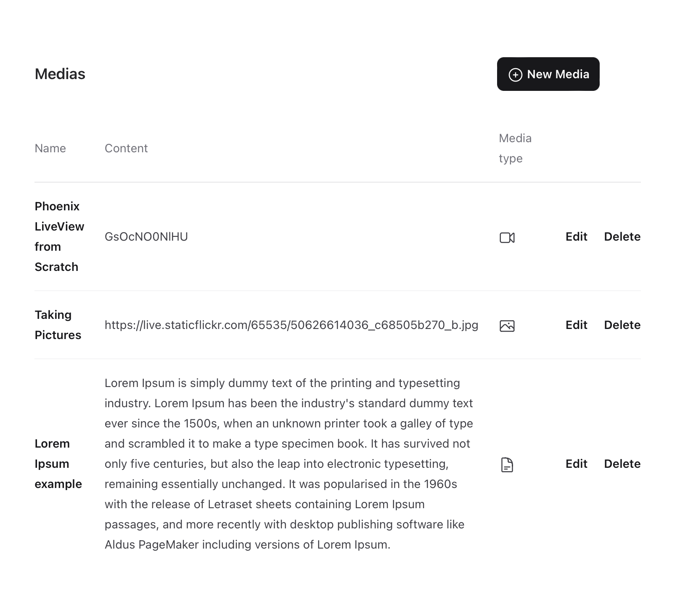
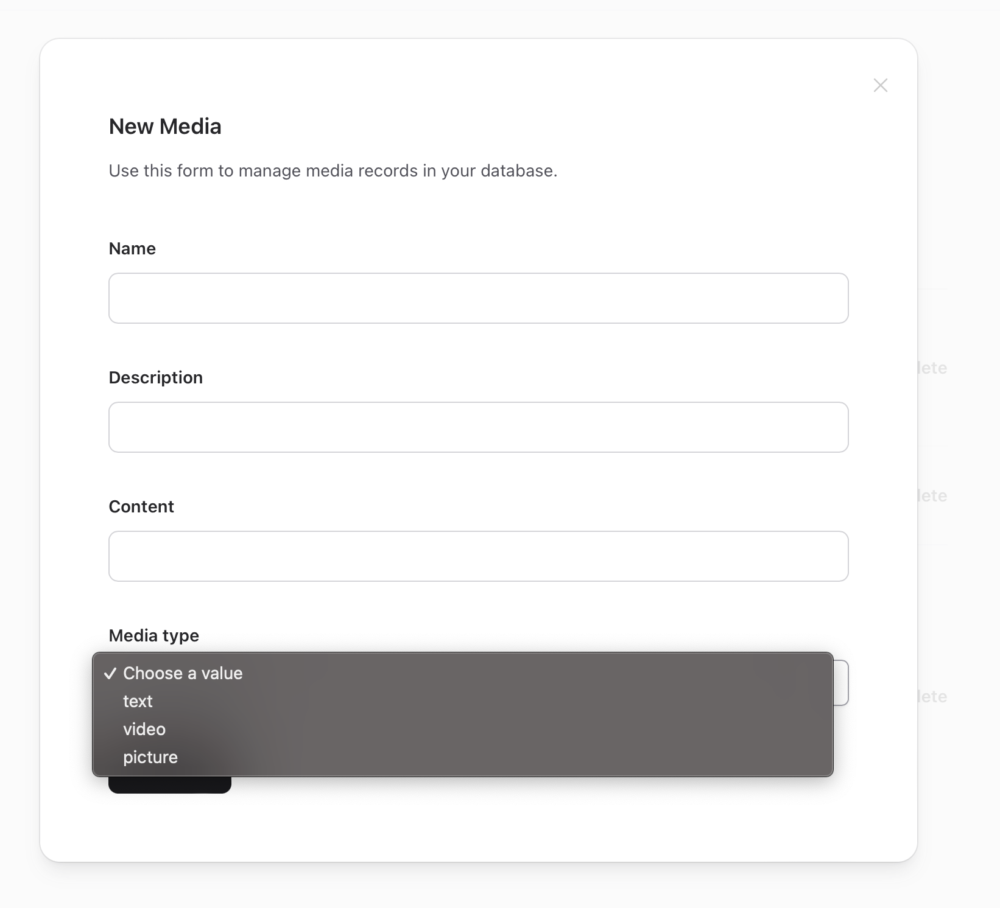
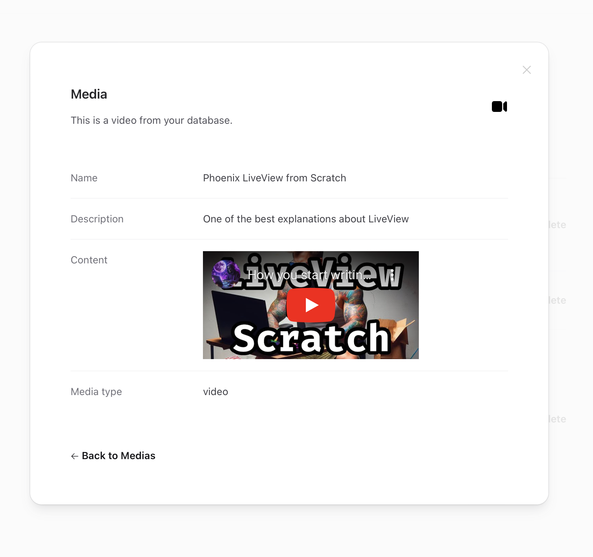
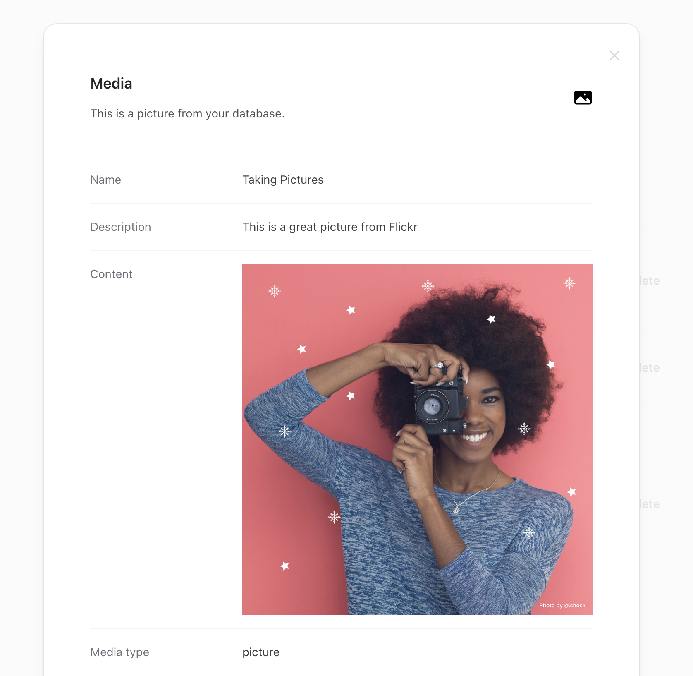
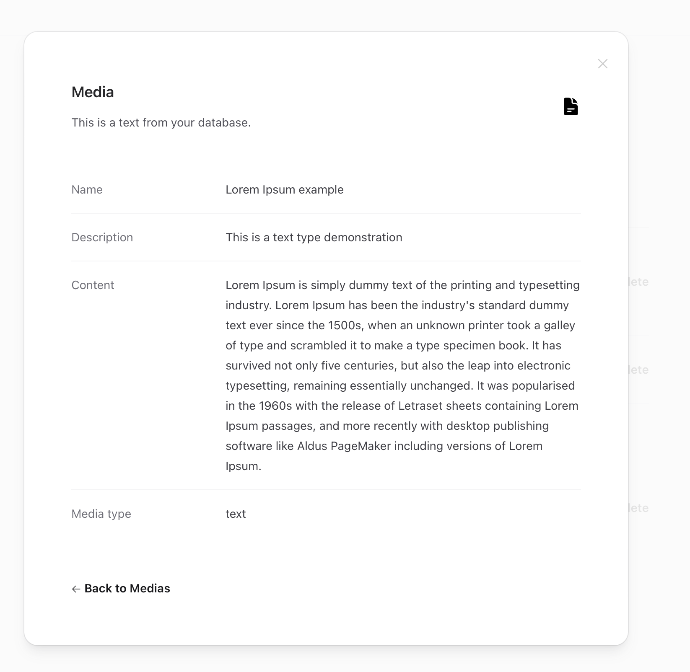
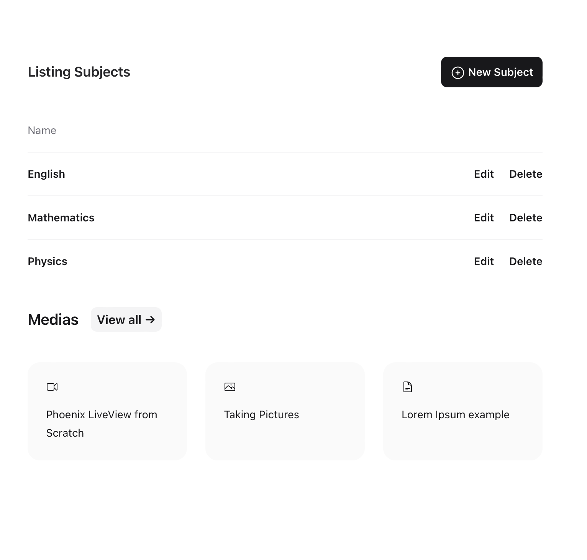

# Silva application
## Demonstrating a reusable component

The purpose of this application is to demonstrate a LiveView Component that can dynamically display three different formats of content (videos, pictures and texts).

To start your Phoenix server:

  * Run `mix setup` to install and setup dependencies
  * Start Phoenix endpoint with `mix phx.server`
  * Create the SQLite running the `mix phx.migrate`

Now you can visit [`localhost:4000`](http://localhost:4000) from your browser where you can see the two LiveViews developed for this exercise:
  * [`localhost:4000/medias`](http://localhost:4000/medias) - The Media screen where we might register new medias based on its type (texts, videos and pictures). Once registered, we might open the Modal screen and see each content type being handled by the component.
  * [`localhost:4000/subjects`](http://localhost:4000/subjects) - To see the dynamic Live Component included on a different page.


## Media list screen
In order to provide a list of different media types, I've created a LiveView CRUD called Medias.

<div align="center">
  
</div>


Here is where it is possible to insert new medias and assign it to a specific type, being video, text or picture.

<div align="center">
  
</div>

The `medias` schema is described below where it is highlighted the Enum `media_type`:

```elixir
schema "medias" do
    field :name, :string
    field :description, :string
    field :content, :string
    field :media_type, Ecto.Enum, values: [:text, :video, :picture]

    timestamps(type: :utc_datetime)
  end
```

The atoms `:text`, `:video` and `:picture` are passed as parameter to the `DynamicModalComponent` and it renders the content based on it.

Here we have an example for each media type.

### Video media type

The `DynamicModalComponent` receives the `:video` type parameter and based on it render the embedded YouTube video.

<div align="center">
  
</div>

### Picture media type

The `DynamicModalComponent` receives the `:picture` type parameter and based on it render the embedded Flickr photograph.

<div align="center">
  
</div>

### Text media type

When the `DynamicModalComponent` receives the `:text` type parameter it just present the text content.

<div align="center">
  
</div>

There's an underlying icon on the right-top corner for each media type preseted when we open the Modal screen.


## Component call from different location
In order to provide an example where we can use the coponent from a different location, I've created a LiveView called Subjects where there's a card list calling the Medias.

This is screen can be accessed on [`localhost:4000/subjects`](http://localhost:4000/subjects)

Once we click on a card, it shows up the Model screen.

<div align="center">
  
</div>


